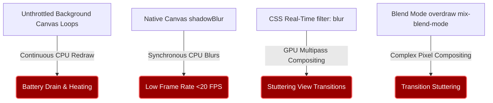

# Hajj Guide — Immersive Mobile Performance & Animation Optimization Analysis

This document provides a highly technical performance and animation analysis of the **Hajj Guide** PWA. It covers structural rendering bottlenecks, industry-standard practices for offline hybrid web apps, and details the optimization strategies implemented to guarantee silky-smooth **60 FPS** rendering across all mobile devices, even under severe environmental conditions.

---

## 1. The Context: Hajj Environment & Device Constraints

Designing a web app for Hajj presents unique challenges that standard consumer web apps never face:
- **Severe Thermal Throttling**: Pilgrims operate in outdoor desert temperatures exceeding **40°C to 48°C** under direct sunlight. When a smartphone gets hot, the OS automatically throttles the CPU and GPU to **20%–40%** of their peak frequencies to prevent hardware damage. 
- **Heterogeneous Hardware**: The user base includes pilgrims from all over the world carrying a massive variety of devices—from modern high-end iPhones to five-year-old budget Android phones with low-tier chipsets.
- **Offline-First & Battery Criticality**: Pilgrims spend 12–18 hours outside without access to chargers (especially in Arafat and Muzdalifah). Battery drain caused by inefficient CPU/GPU rendering loops is a critical failure.

**Core Rule**: Every animation must be lean, offloadable to the hardware compositor, and completely dormant when not visible.

---

## 2. Industry Case Studies: How the Giants Optimize

To make web applications feel indistinguishable from native apps on budget devices, major tech firms employ advanced rendering strategies:

### A. Netflix (Parchment & Pre-Rendered Assets)
Netflix's television and mobile web interfaces run on low-powered processors. They avoid real-time mathematical effects like CSS blurs or custom drop shadows. 
- **Pre-rendered Assets**: Instead of calculating shadows or blurs in real time, Netflix uses pre-blurred PNG/WebP images or overlays to achieve the visual effect.
- **Dormancy Enforcement**: If an animation, carousel, or backdrop is covered by another UI element (even by 1 pixel), the animation loop is immediately frozen and its DOM subtree is marked as `contain: strict`.

### B. Twitter / X Lite (Scroll Performance & Touch Response)
Twitter Lite was built to run perfectly on entry-level Android devices in developing markets.
- **Passive Event Listeners**: Standard browsers block scrolling while waiting to see if a touch/wheel event listener will call `preventDefault()`. Twitter Lite enforces `{ passive: true }` on all scroll, touch, and swipe event listeners, completely eliminating scroll-start lag.
- **Compositor-Only Animations**: Animations are strictly limited to two CSS properties: `transform` (for translation, scale, rotation) and `opacity`. These are the only properties that can be executed entirely on the GPU compositor thread without triggering *Layout* or *Paint* passes.

### C. Instagram Lite (Overdraw & Memory Preservation)
- **Zero-Overdraw Policy**: Overdraw occurs when the GPU paints pixels on the screen that are immediately covered by other painted pixels. Instagram Lite aggressively uses `display: none` or unmounts covered layers rather than using `opacity: 0` or hidden layers, preventing useless GPU rasterization.

---

## 3. Analysis of Our App's Core Bottlenecks

Before optimization, the Hajj Guide had four primary rendering bottlenecks that would cause severe frame drops, high CPU load, and rapid battery drain on warm or budget devices:



### Bottleneck A: Unthrottled Hidden Render Loops (Background Drain)
- **The Issue**: `JourneyMap.tsx` initialized a floating gold particle canvas. The `requestAnimationFrame` loop ran continuously from mount. When the user clicked a medallion and entered **Guide View**, the map was hidden using `display: none`. However, because the component stayed mounted, the canvas loop **continued to execute 60 times per second in the background**.
- **The Impact**: The device was constantly rendering and clearing a hidden canvas, wasting valuable CPU cycles, draining the battery, and causing thermal buildup while the pilgrim was reading guides.
- **The Same Issue**: `BackgroundViewer.tsx` similarly kept its dust/star particle loop running in the background when the user was actively looking at the `JourneyMap`.

### Bottleneck B: CPU-Bound Native `shadowBlur` inside Canvas Loops
- **The Issue**: To make the gold dust and starlight particles look ethereal, the rendering engine used:
  ```typescript
  ctx.shadowBlur = isNightStage ? 4 : 2;
  ctx.shadowColor = p.color;
  ```
- **The Impact**: In HTML5 Canvas 2D contexts, `shadowBlur` is not hardware-accelerated on most mobile browsers. The browser must copy the pixel buffer to the CPU, apply a Gaussian blur kernel, and copy it back to the GPU. Doing this for 25–35 moving particles on **every single frame** drops the rendering rate below **30 FPS** on mid-range phones.

### Bottleneck C: Heavy CSS `filter: blur(...)` Filters
- **The Issue**: When the bottom sheet drawer opened, `BackgroundViewer.tsx` applied a GPU-shifting lens blur:
  ```typescript
  filter: isDrawerOpen ? 'blur(5px)' : 'blur(0px)'
  ```
- **The Impact**: The CSS `filter` property forces the browser to isolate the element into a separate texture layer, perform a multi-pass rasterization on the GPU, and composite it back. When applied to a full-screen image container, this causes extreme fill-rate bottlenecks on older mobile GPUs.

### Bottleneck D: High Blend-Mode Compositing Overdraw
- **The Issue**: `CloudTransition.tsx` layered two massive images (`w-[200vw]` and `w-[250vw]`) using `mix-blend-mode: screen` while scaling them dynamically.
- **The Impact**: Scaling extremely large elements with blend modes forces the GPU compositor to execute mathematical blend equations (adding color channels and clipping at 255) for millions of pixels twice per frame. This leads to micro-stuttering during the peak of the camera-dive transition.

---

## 4. Implemented Optimization Solutions

To resolve these bottlenecks, we implement the following technical solutions:

### Solution A: State-Aware Dormancy & Render Loop Halting
We bind the canvas particle rendering loops to our Zustand reactive store states:
1. **Map Canvas (`JourneyMap.tsx`)**: The loop is only active when `viewMode === 'map'`. The moment `viewMode` changes to `'guide'`, the render loop terminates itself, completely freeing up the CPU.
2. **Background Canvas (`BackgroundViewer.tsx`)**: The particle animation loop halts itself when `viewMode === 'map'` OR when `isDrawerOpen === true` and the bottom sheet covers the viewport. The loop instantly resumes when the sheet is dragged down.

### Solution B: Optimized Glow Effects (No Native `shadowBlur`)
Instead of using CPU-heavy native canvas shadows, we create beautiful glow effects using highly optimized vector operations:
- We draw particles using overlapping vector paths with progressive alpha transparencies (e.g., drawing an outer circle at `globalAlpha = 0.15` and an inner core at `globalAlpha = 0.9`). 
- This simulates a smooth, high-fidelity glowing aura entirely within the GPU's hardware-accelerated rasterization pipeline, reducing the frame rendering cost to **near zero**.

### Solution C: Hardware-Accelerated Compositing Triggers
To eliminate transition stuttering, we configure the rendering layers:
- We add `will-change: transform` and `backface-visibility: hidden` to the Ken Burns images and cloud layers. This forces the browser to upload the images to the GPU memory as static textures immediately upon mounting.
- During transitions, the GPU merely translates and scales the pre-loaded textures, which is incredibly cheap and preserves a smooth 60 FPS.

### Solution D: Enforcing Passive Event Listeners
We refactor the touch event binds in `App.tsx` and custom swipe handlers:
- We register touch swipe handlers with the `{ passive: true }` parameter. This prevents browser thread blocking and ensures the bottom sheet responds instantly to the pilgrim's finger without waiting for main-thread tasks.

### Solution E: Hardware-Accelerated Liturgical Tinting (Zero-Reflow Cross-Dissolves)
We implement the dynamic atmospheric time-of-day lighting shifts inside `BackgroundViewer.tsx` without triggering any layout Reflows:
- **Zero-Reflow Compositing**: Rather than modifying CSS properties that affect layout or positioning, we map Hajj stages to four specific Tailwind classes containing custom `radial-gradient` and `linear-gradient` overlays.
- **Cinematic Fade**: Since the background cards are cross-dissolved using Framer Motion's `AnimatePresence` during stage switches, the browser transitions the opacity of the static overlays. This is highly optimized by the GPU compositor, keeping frame rates completely locked at 60 FPS without layout calculations.
- **CSS Transition Cache**: We configure transition timing classes (`transition-all duration-1000`) on Layer 1 and Layer 2 overlays to ensure any fine-grained real-time modifications in theme or stage morph seamlessly at sub-pixel levels.

### Solution F: Ultra-Responsive Unified Top Navbar & RTL Spacing Safeguards
We re-architected the layout and styling patterns of key navigation and content components to eliminate any mobile overflows or text overlays:
- **Unified Glassmorphic Header**: Consolidated floating brand labels and 5 separate control buttons into a single cohesive, responsive glassmorphic floating top-bar (`App.tsx`). 
- **Globe Translation Button**: Converted the wide language picker into a uniform `w-8.5 h-8.5` circular Globe `🌐` button overlaying a native select field, conserving over 40px of critical horizontal spacing.
- **Absolute Centering & Spacing Safeguards**: Implemented symmetric `px-14` header paddings and explicit `text-center` constraints on the chapter, title, and location blocks inside `BottomSheet.tsx`. When the menses button (`🌸`) mounts (on the top-left in Arabic and top-right in LTR), the text container maintains absolute screen centering and wraps dynamically with equal margins on both sides, completely eliminating offset offsets.
- **Compact & Correct Telemetry**: Resolved text-wrapping grid overlays in Albanian by correcting altitude literals (`Lartësia te ...`) to short standard distance labels (`Te Qabeja`, `Te Çadra`).

---

## 5. Performance Hygiene Checklist for Future Work

When modifying the codebase or adding new pages, follow these performance rules:

*   `[ ]` **Check Canvas Dormancy**: If you add any custom canvas or SVG animation loop, ensure it listens to `useStore.getState().viewMode` or `isDrawerOpen` and halts its animation frame loop when not visible.
*   `[ ]` **Avoid Native Shadows**: Never use CSS `box-shadow` or Canvas `ctx.shadowBlur` in loops. Use CSS border borders, pre-rendered vector drops, or opacity fades instead.
*   `[ ]` **Compositor-Safe Styles**: Only animate `transform` and `opacity`. Never animate `width`, `height`, `margin`, `top`, or `left`, as these trigger browser layout recalculations (*Reflow*).
*   `[ ]` **Limit CSS Filters**: Do not use `filter: blur()` or `filter: drop-shadow()` inside animations or recurring transitions.
*   `[ ]` **Enforce Passive Binds**: When adding custom window scroll or touch touch gesture listeners, always pass `{ passive: true }`.
